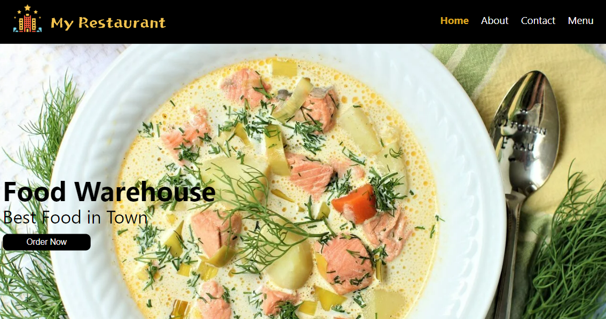
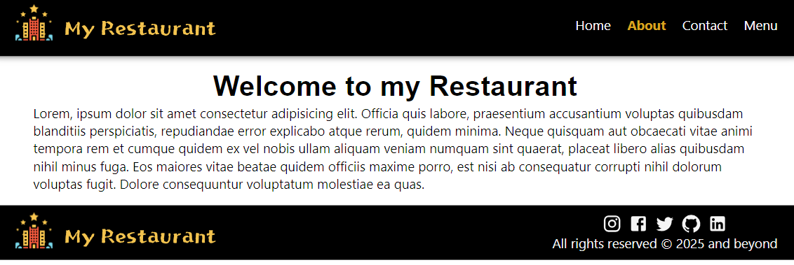
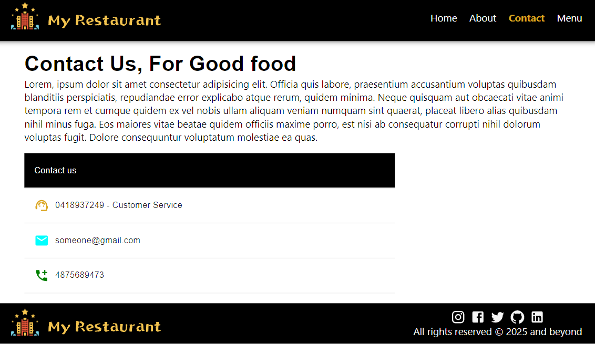
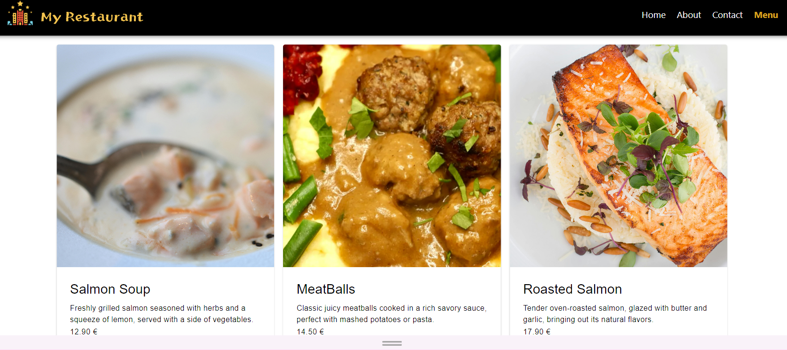
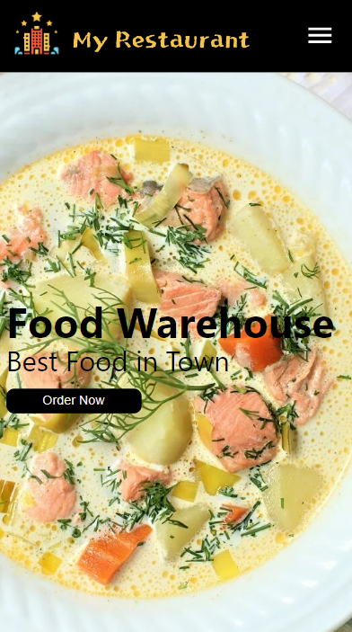
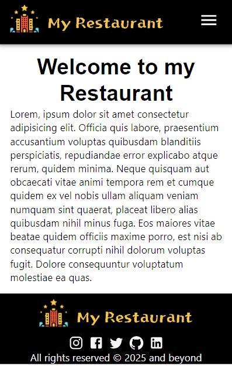
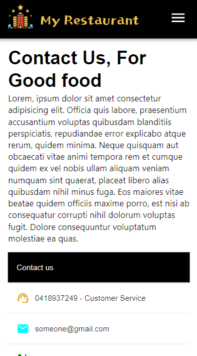
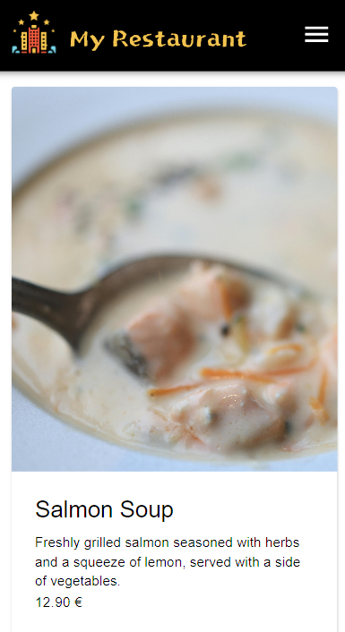

# 🍽️ My Restaurant Website

A fully responsive **Restaurant Website** built with **React**.  
The project showcases a modern restaurant landing page with multiple sections and smooth navigation.

---

## ✨ Features

- 🏠 **Home, About, Contact, and Menu pages**  
- 📱 **Fully responsive design** (desktop & mobile)  
- 🎨 Styling with **Material UI (MUI)** + `module.css` for custom tweaks  
- 🔀 **React Router** for smooth navigation  
- 📷 Showcases real food items with images and prices  

---

## 🛠️ Tech Stack

- **React.js** ⚛️  
- **Material UI (MUI)** 🎨  
- **React Router** 🌍  
- **CSS Modules** 🎭  

---

## 📸 Screenshots

### 💻 Desktop & Tablet View

  
  
  
  

### 📱 Mobile (iPhone SE)

  
  
  
  
  

---

## 🚀 Live Demo

👉 [Click here to view the deployed website](YOUR_DEPLOYED_LINK_HERE)

---
