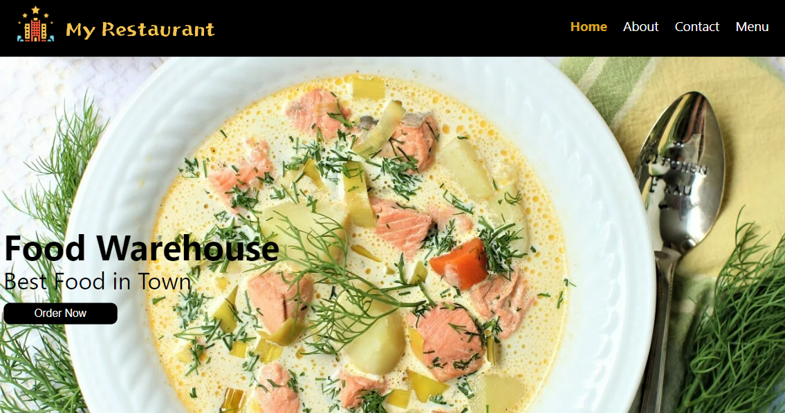
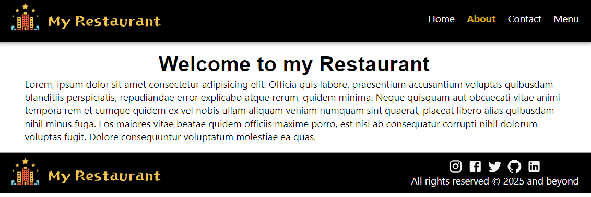
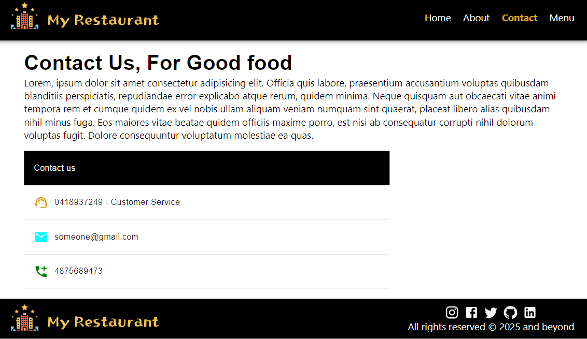
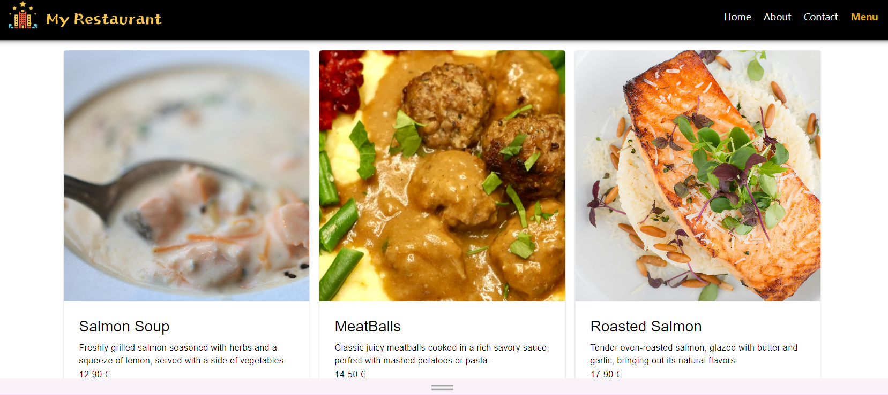
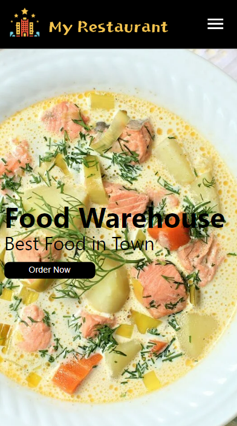
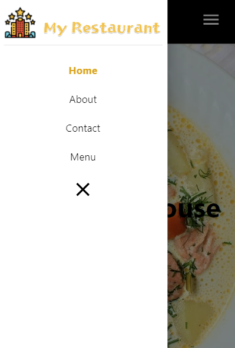
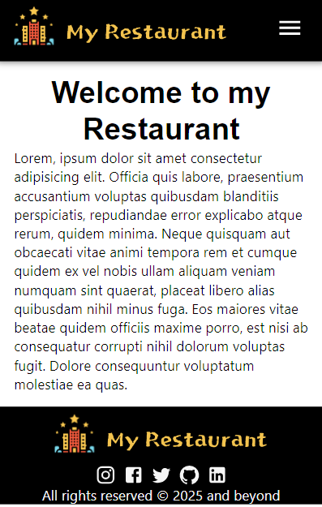
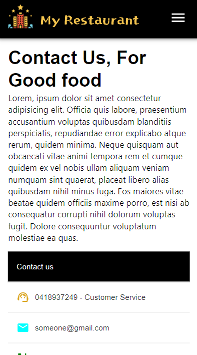
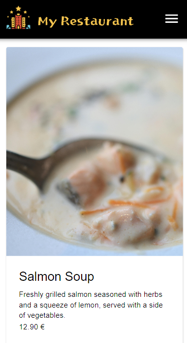

# ğŸ½ï¸ My Restaurant Website

A fully responsive **Restaurant Website** built with **React**.  
The project showcases a modern restaurant landing page with multiple sections and smooth navigation.

---

## ✨ Features

- 🠠**Home, About, Contact, and Menu pages**  
- 📱 **Fully responsive design** (desktop & mobile)  
- 🨠Styling with **Material UI (MUI)** + `module.css` for custom tweaks  
- 🔀 **React Router** for smooth navigation  
- 📷 Showcases real food items with images and prices  

---

## ğŸ› ï¸ Tech Stack

- **React.js** âš›ï¸  
- **Material UI (MUI)** 🨠 
- **React Router** 🌠 
- **CSS Modules** 🭠 

---

## 📸 Screenshots

### 💻 Desktop & Tablet View

  
  
  
  

### 📱 Mobile (iPhone SE)

  
  
  
  
  

---

## 🚀 Live Demo

👉 [Click here to view the deployed website](https://react-restaurant-ui-blue.vercel.app/)

---
## 🔗 Connect With Me on LinkedIn

👉 [My LinkedIN](https://www.linkedin.com/in/basudev-pokharel/)

---